# AI-Powered SRE Incident Automation Platform

AI-assisted incident response pipeline using Kubernetes, Istio, Grafana, n8n, Ollama, and Telegram.

## 1) Executive Summary

This project implements an event-driven incident workflow for microservices running in Kubernetes:

1. Istio sidecars expose service traffic and error telemetry.
2. Prometheus stores mesh metrics.
3. Grafana Alerting evaluates SLO/SLI thresholds and sends webhooks.
4. n8n receives the alert, calls Ollama for triage output, normalizes model output, and forwards a clean incident card to Telegram.

Outcome: the on-call engineer receives a readable incident summary and first debug command within seconds of alert firing.

## 2) Stack and Runtime

- OS/runtime: WSL2 host + Docker
- Kubernetes: Minikube
- Service mesh: Istio (Envoy sidecars)
- Monitoring and alerting: Prometheus + Grafana Alerting
- Automation and orchestration: n8n
- Local LLM inference: Ollama
- Notification channel: Telegram Bot API

## 3) High-Level Architecture

```text
Client Traffic
	-> Gateway API / Istio Gateway
	-> Bookinfo Services (with Envoy sidecars)
	-> Prometheus (metrics scrape)
	-> Grafana Alert Rule fires
	-> n8n Webhook Trigger
	-> Ollama (incident analysis)
	-> n8n JSON parsing/normalization
	-> Telegram incident message
```

Design goal: keep AI in the loop for summarization and guidance, but keep deterministic parsing and formatting logic in n8n to avoid brittle notifications.

## 4) Mesh Setup and Sidecar Injection

Istio sidecar injection is enabled on the default namespace, so Bookinfo workloads get an Envoy proxy automatically. Pod readiness (2/2 containers) verifies app + sidecar presence.

Checks performed:

- Bookinfo pods in default namespace: sidecars present (2/2 READY)
- `istio-system` core components: `istiod`, `prometheus`, `kiali` running
- Gateway proxy present for Gateway API ingress path

Artifacts:

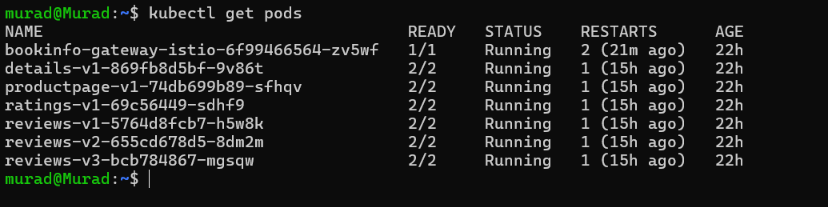
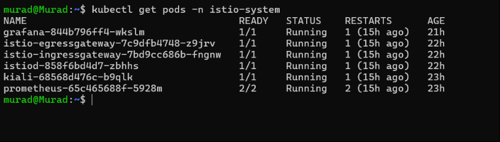

## 5) Observability Validation with Kiali

Kiali was used to validate both control-plane health and runtime traffic flow:

- Mesh graph confirms the control plane is healthy.
- Service graph shows normal green path: `productpage -> reviews -> ratings`.

Artifacts:

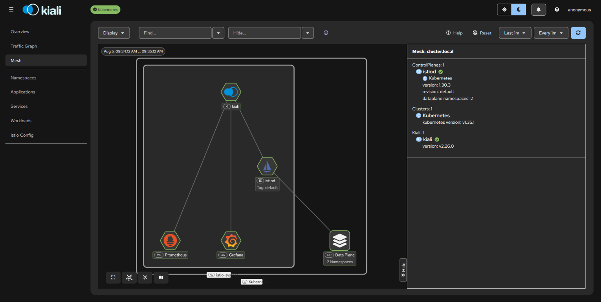
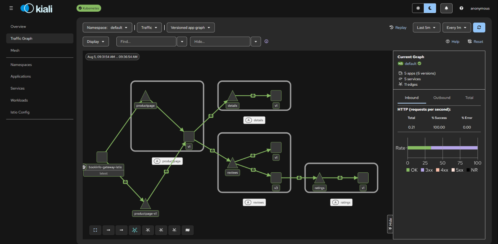

## 6) Zero-Trust Policy Validation

An Istio `AuthorizationPolicy` (`protect-ratings`) was applied to restrict who can call the `ratings` workload.

Validation flow:

1. Deny path tested first (cross-namespace access blocked).
2. Expected behavior observed: `403 Forbidden`.
3. Policy adjusted to allow only intended source namespace/workload.
4. Traffic recovered for approved source.

Artifacts:

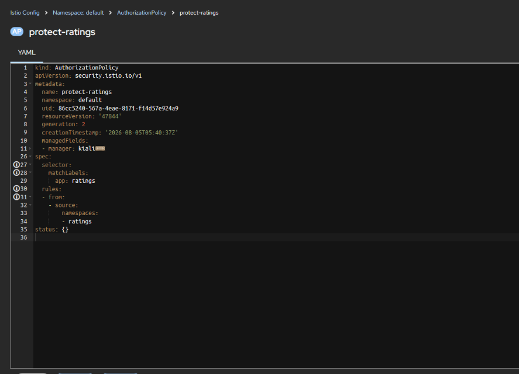
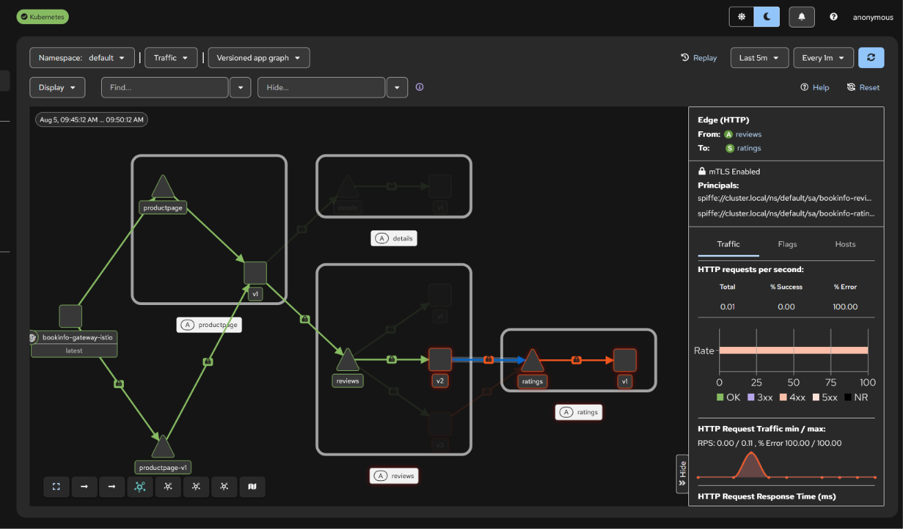

## 7) AI Incident Workflow in n8n

### 7.1 Node Flow

The n8n workflow is organized into four logical stages:

1. `Webhook` node receives Grafana alert payload.
2. `Ollama` node generates structured incident analysis text.
3. `Function` node sanitizes/extracts/parses JSON reliably.
4. `Telegram` node sends normalized incident report.

This separation makes the pipeline resilient even when model output includes markdown fences or extra text.

Artifact:

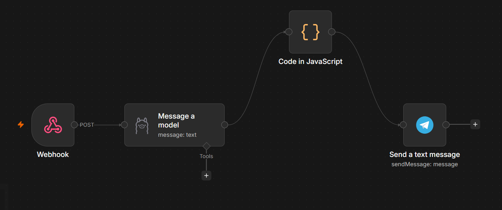

### 7.2 Function Node (between Ollama and Telegram)

Use this code in your n8n `Function` node right after Ollama and before Telegram:

```javascript
let raw = $json.content.trim();

raw = raw.replace(/^```(?:json)?\s*/i, '').replace(/```\s*$/, '');

function extractFirstJsonObject(str) {
	const start = str.indexOf('{');
	if (start === -1) return null;

	let depth = 0;
	for (let i = start; i < str.length; i++) {
		if (str[i] === '{') depth++;
		else if (str[i] === '}') {
			depth--;
			if (depth === 0) {
				return str.slice(start, i + 1);
			}
		}
	}
	return null;
}

const jsonStr = extractFirstJsonObject(raw);
if (!jsonStr) {
	throw new Error('No balanced JSON object found in model output: ' + raw);
}

let parsed;
try {
	parsed = JSON.parse(jsonStr);
} catch (err) {
	throw new Error('Failed to parse extracted JSON: ' + jsonStr);
}

const ai = {
	workload_type: parsed.workload_type || 'pod',
	workload_name: parsed.workload_name || 'unknown',
	namespace: parsed.namespace || 'default',
	summary: parsed.summary || 'No summary available.',
	debug_command: parsed.debug_command ||
		`kubectl logs -n ${parsed.namespace || 'default'} ${parsed.workload_name || 'unknown'}`
};

return [{ json: { ...$json, ai } }];
```

What this does:

1. Removes markdown code fences if Ollama wraps JSON in ```json blocks.
2. Extracts only the first balanced JSON object from mixed text.
3. Parses JSON safely and throws explicit errors when malformed.
4. Applies defaults so Telegram output is never empty.
5. Returns merged payload as `$json.ai` for downstream formatting.

## 8) End-to-End Failure Simulation

To prove the full loop, a fault was injected into `ratings` (100% HTTP 500 via Istio `VirtualService`).

Expected and observed behavior:

1. Error rate spikes at service mesh metrics layer.
2. Grafana rule transitions to firing state.
3. Webhook triggers n8n execution.
4. Ollama response is parsed by function node.
5. Telegram receives an actionable incident card.

Artifacts:

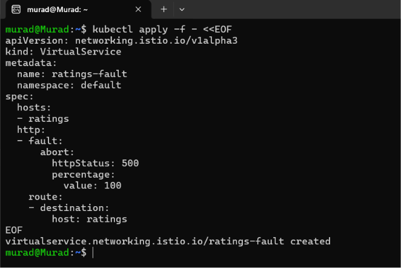
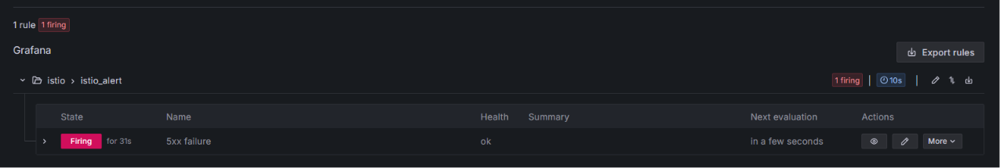
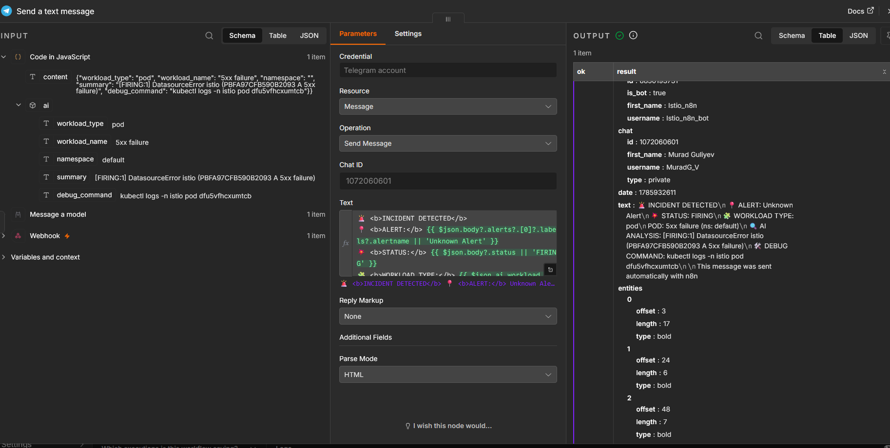
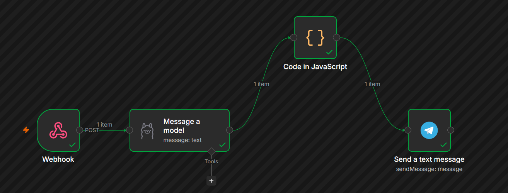
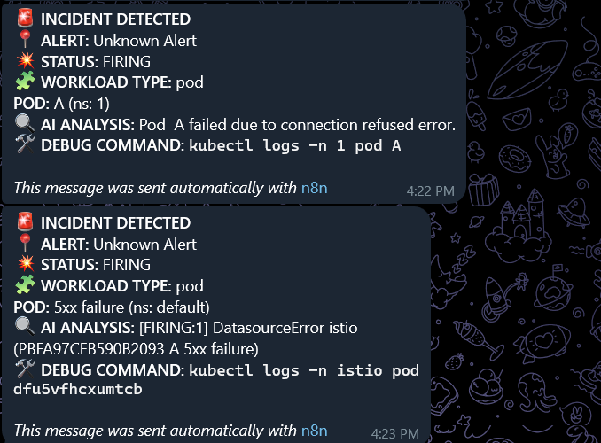

## 9) Telegram Message Format (Recommended)

For clear paging messages, map `ai` fields to a compact template in the Telegram node:

```text
[AI SRE INCIDENT]
Workload: {{$json.ai.workload_type}}/{{$json.ai.workload_name}}
Namespace: {{$json.ai.namespace}}
Summary: {{$json.ai.summary}}
Debug: {{$json.ai.debug_command}}
```

## 10) Operational Notes

- Keep alerts high-signal: route only actionable severities to Telegram.
- Keep model prompts strict: ask for one JSON object and fixed keys.
- Keep deterministic guardrails: always parse and validate in n8n before notification.
- Keep a fallback command: default `kubectl logs` command is useful under pressure.

## 11) Troubleshooting

1. No Telegram message:
	 - Confirm Grafana webhook target is reachable from Grafana container.
	 - Check n8n execution history for node-level errors.
	 - Validate Telegram bot token/chat ID.
2. JSON parse errors:
	 - Ensure Ollama prompt requests strict JSON only.
	 - Keep the function node in place to strip fences and isolate first JSON object.
3. Alert not firing:
	 - Verify Prometheus query and alert thresholds.
	 - Confirm fault injection is active and affecting live traffic.
4. Missing workload fields:
	 - Inspect incoming Grafana payload fields.
	 - Extend function node mapping if your alert labels differ.

## 12) Future Improvements

1. Add deduplication in n8n to reduce alert storms.
2. Attach runbook links based on workload name/namespace.
3. Add severity-aware routing (different Telegram channels).
4. Persist incidents to a datastore for trend analysis.
5. Add auto-remediation suggestions with confidence labels.

## Conclusion

This lab demonstrates a practical pattern for AI-augmented SRE operations: Istio provides high-fidelity telemetry, Grafana detects incidents, and n8n + Ollama converts raw alerts into fast, human-readable triage guidance. The key engineering choice is combining flexible LLM reasoning with deterministic post-processing, which keeps the final incident message reliable for on-call use.
